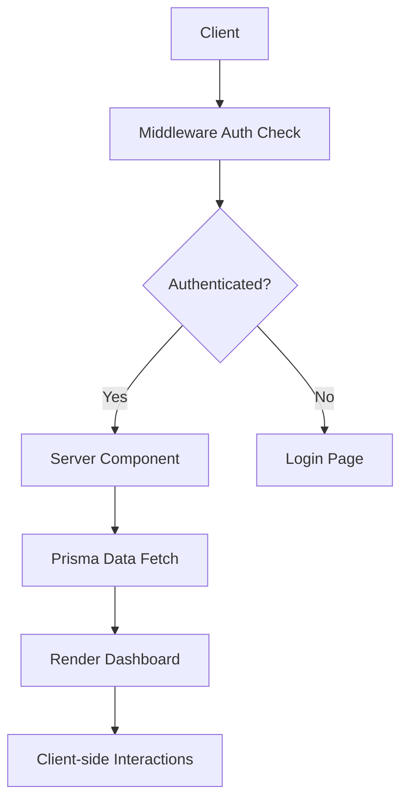

# Paylist PWA Dashboard Workflow

## Core Architecture
1. **Next.js 13 App Router**
   - File-system based routing (`app/` directory)
   - Server Components for data fetching
   - Client Components for interactivity

2. **Authentication Flow**
   - NextAuth.js with credential provider
   - Session management via JWT
   - Protected routes using middleware

3. **Data Layer**
   - Prisma ORM connecting to database
   - Zod schema validation
   - Server Actions for mutations

## Key Interaction Flow

## Critical Paths
1. User Login
2. Data Dashboard Rendering
3. Real-time Updates
4. Offline Sync

## Deployment Pipeline
1. `prisma generate` during build
2. Next.js static optimization
3. PWA manifest generation
4. Service worker registration
